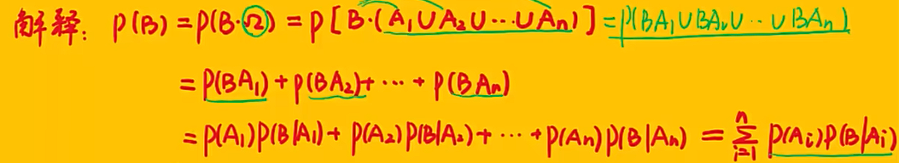

# 减法公式
$P(A-B)=P(A)-P(AB)$
注:若$\textcolor{red}{B \subseteq A} \to P(A-B)=P(A)-P(B)$，$P(A\overline{B})=P(A)-P(AB)$
($\small\text{看见}\ \overline{X}\ \text{和交集，用减法}$)

# 加法公式
$P(A \cup B) = P(A) + P(B) - P(AB)$$P(A \cup B \cup C) = P(A) + P(B) + P(C) - P(AB) - P(AC) - P(BC) + P(ABC)$口诀：+ 奇 - 偶     <small>(奇偶为括号内字母数量)</small>

# 乘法公式
$P(AB) = P(A)P(B|A)$
三事件乘法公式：$P(ABC) = P(A)P(B|A)P(C|AB)$
四事件乘法公式：$P(ABCD) = P(A)P(B|A)P(C|AB)P(D|ABC)$

# 全概率公式
1. 完备事件组 ：设 $A_1, A_2, \dots, A_n$ 为 $\Omega$ 的一个事件组，且满足$A_1, A_2, \dots, A_n$ 两两互斥；  $A_1 \cup A_2 \cup \dots \cup A_n = \Omega$。则称 $A_1, A_2, \dots, A_n$ 为 $\Omega$ 的一个完备事件组（或称为 $\Omega$ 的一个划分）
2. 设 $B$ 为任意一个事件，$A_1, A_2, \dots, A_n$ 为 $\Omega$ 的一个完备事件组，则 $$ P(B) = P(A_1)P(B|A_1) + P(A_2)P(B|A_2) + \dots + P(A_n)P(B|A_n) $$
# 贝叶斯公式
设 $B$ 为任意一个事件，$A_1, A_2, \dots, A_n$ 为 $\Omega$ 的一个完备事件组，则 $$ P(A_j|B) = \frac{P(A_jB)}{P(B)} = \frac{P(A_j)P(B|A_j)}{\sum_{i=1}^{n} P(A_i)P(B|A_i)} $$<small>分母为全概率公式</small>

# 二项概率公式
设 $n$ 次独立重复的伯努利试验中，每次试验有两种可能结果 $A$ 与 $\overline{A}$，其中 $P(A)=p$，$P(\overline{A})=1-p$，则在 $n$ 次试验中事件 $A$ 发生 $k$ 次的概率： $$ P_n(k) = \mathrm{C}_n^k p^k (1-p)^{n-k}, \quad k = 0,1,\dots,n $$

注：二项概率公式三要素： ① $n$ 重独立； ② 两种结果 $A$ 与 $\overline{A}$； ③ 每次 $P(A)=P$。

